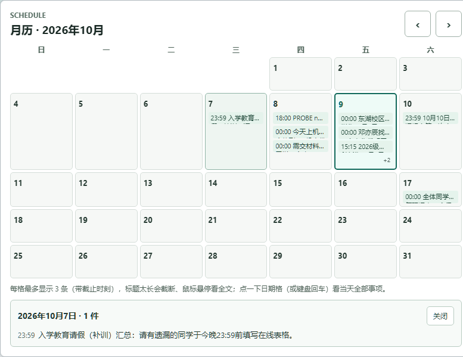
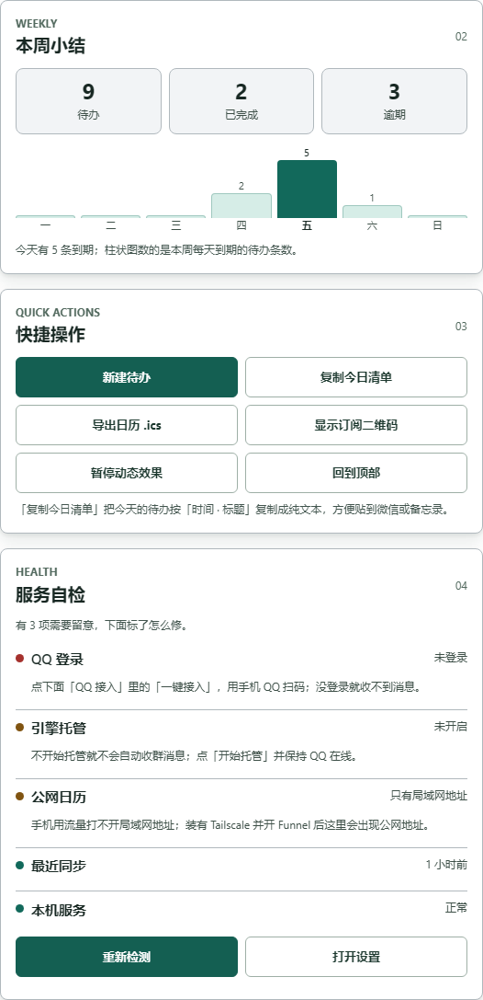
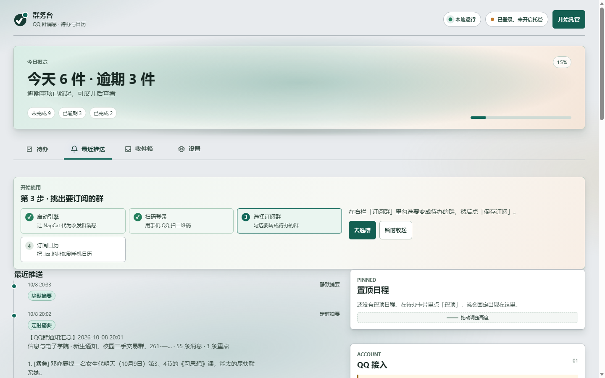
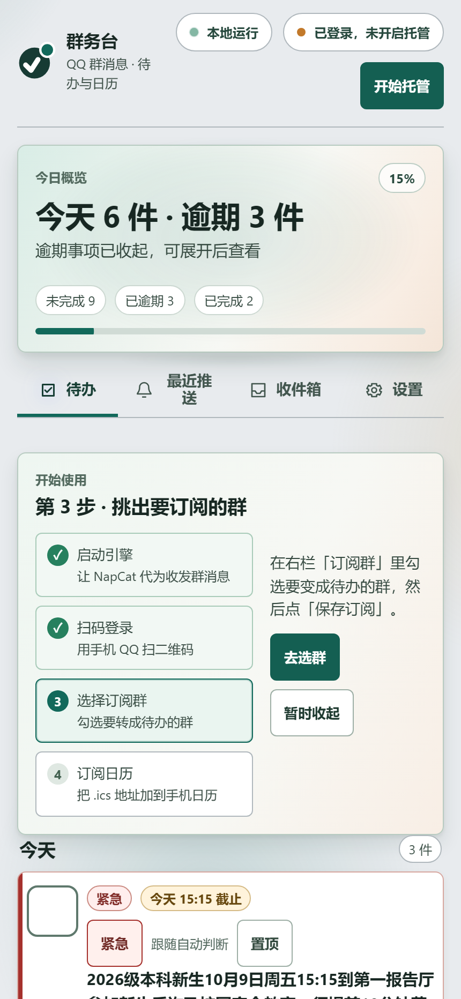

<div align="center">

# 群务台 · notice-hub

**把 QQ 群里的通知，自动变成待办和日历。**

只读接收指定 QQ 群的新消息 → 过滤闲聊 → 提取通知/待办/截止时间 → 网页待办台 + iPhone 日历订阅（可选微信推送）。

[](LICENSE)
[](https://www.python.org/)

[](https://github.com/ExpertKT/notice-hub/actions/workflows/tests.yml)
[](https://github.com/ExpertKT/notice-hub/releases/latest)

[下载最新版](https://github.com/ExpertKT/notice-hub/releases/latest) · [使用说明](docs/使用说明.md) · [安卓 App](docs/安卓App.md) · [NapCat 安装](docs/napcat-setup.md)

</div>

<p align="center">
  
  <br />
  <sub>桌面端：今日概览 + 按截止时间分组的待办，右侧常驻「置顶日程」和接口状态</sub>
</p>

---

## 它解决什么问题

大学里的通知散在各科群的聊天记录里：作业、实验报告、报名、考试时间、临时调课。
一条条翻聊天记录很累，翻到了也容易忘。

群务台把这件事变成三步：

| 你原本要做的 | 装好之后 |
| --- | --- |
| 每天翻 8 个群、几百条消息 | 页面只显示 **需要你做的事**，按今天 / 本周 / 已过期排好 |
| 自己记着截止时间 | 每条待办带截止时间，卡片上直接标「今天 15:15 截止」 |
| 手机日历里再手动抄一遍 | iPhone 日历订阅一个 `.ics` 地址，待办自动出现在日历里 |

> 项目名不叫 `qq-*`，是因为接收端是插件式的：`qq_live_digest/receiver.py`（OneBot v11 / NapCat）
> 和 `qq_live_digest/bot.py`（QQ 官方机器人）是两个并列入口，以后接别的渠道再加一个即可。

---

## 界面预览

<table>
<tr>
<td width="50%"><br /><sub><b>月历</b>：每格最多 3 条（带时刻和时间前缀），点某天就地展开当天全部事项，超出的用 <code>+N</code> 提示</sub></td>
<td width="50%"><br /><sub><b>右栏三块面板</b>：本周小结（含每天到期条数柱状图）、快捷操作、服务自检（哪里没通、怎么修）</sub></td>
</tr>
</table>

<p align="center">
  
  <br />
  <sub>最近推送：每批消息的摘要都留档，点开可看判定依据和原文</sub>
</p>

<p align="center">
  
  <br />
  <sub>手机端：同一个页面自适应，支持从浏览器「添加到主屏幕」当轻量 App 用</sub>
</p>

---

## 核心能力

- **只收你关心的群**：白名单式订阅，留空就是不收任何群；闲聊自动降噪，只有明确通知、待办、紧急事项进入链路。
- **待办台**：`今天 / 本周 / 以后 / 已完成` 分组，逾期默认折叠；候选事项先「待确认」再进正式待办，可完成、忽略、置顶、稍后提醒。
- **iPhone / Android 日历订阅**：`/calendar.ics`（RFC 5545，带 `VTIMEZONE`）＋ 网页月历视图；不用 CalDAV、不用装捷径，系统日历里直接订阅。
- **新建与手改**：页面上的「新建待办」可直接补一条（内容 + 可选截止时间）；每条待办能「纠错」，纠正结果按群汇总成规则建议。
- **推送摘要**：WxPusher / Server酱 / PushPlus / Webhook / QQ 私聊，失败自动回退；不配任何通道也能用（待办照常入库）。
- **截止提醒**：默认早上 07:30 汇总今天到期、晚上 21:00 预告明天的；紧急事项始终放行。
- **附件解析**：群里发的 PDF / Word / Excel / PPT / txt / zip / 截图自动下载解析，正文进「查看完整原文」。
- **托管与开机自启**：托盘或网页一键「开始托管」——自动关掉电脑版 QQ、起 NapCat；结束托管再换回来。免管理员写当前用户启动项。
- **一键出货包**：`packaging/`（PyInstaller + 常驻托盘启动器），双击即用、自动打开浏览器、首次运行建桌面快捷方式、单实例互斥。
- **数据不出本机**：消息、摘要、待办全部落在本机 SQLite；只有你配置的模型和推送通道会收到内容。

---

## 快速开始

### 方式一：下载出货包（推荐，免装 Python）

1. 到 [Releases](https://github.com/ExpertKT/notice-hub/releases/latest) 下载 `QQ-Notice-Hub.zip`，解压到任意目录（路径别用中文和空格）。
2. 双击 `QQ-Notice-Hub.exe`，浏览器会自动打开控制台（首次运行会在桌面建快捷方式）。
3. 按页面右上角的**四步引导**走：`启动引擎 → 扫码登录 → 选群 → 订阅日历`。
   - 点「一键接入 / 启动并登录」，程序会启动 NapCat 并显示二维码，用手机 QQ 扫码；
   - 在右栏「订阅群」里勾选要变成待办的群，点「保存订阅」；
   - 到设置页把订阅地址加进 iPhone / Android 日历，或直接扫二维码。

> 想先读一遍再动手：解压目录里的 `先看我.txt` 与 [docs/使用说明.md](docs/使用说明.md)。

### 方式二：源码运行（开发用）

```powershell
git clone https://github.com/ExpertKT/notice-hub.git
cd notice-hub

python -m venv .venv
.\.venv\Scripts\python.exe -m pip install --upgrade pip
.\.venv\Scripts\python.exe -m pip install -r requirements.txt

Copy-Item .env.example .env
# 编辑 .env：至少填要监控的群、OneBot token（可选）一个推送通道、以及可选的模型 Key

.\.venv\Scripts\python.exe main.py doctor   # 先自检
.\.venv\Scripts\python.exe main.py run      # 启动服务（含待办台 8766）
```

需要登录后自动启动，运行 `install-task.ps1` 注册计划任务。

### 方式三：安卓 App（手机当客户端）

群务台本体跑在电脑上，安卓 App 是手机端外壳（WebView 封装）：点开就是待办和月历，不用每次开浏览器输地址。

1. 到 [Releases](https://github.com/ExpertKT/notice-hub/releases/latest) 下载 **`notice-hub-android.apk`**；
   手机上点开文件，按提示允许当前浏览器「安装未知应用」后安装。
2. 首次打开填两个值：**服务器地址**（电脑与手机同一 Wi-Fi 用 `http://电脑IP:8766`；不同网络用 Tailscale 的 `https://你的机器.xxx.ts.net`）
   和 **Token**（电脑端网页地址栏里 `?token=...` 那串）。
3. 之后启动直接进网页。地址填错或服务器换了，**长按返回键**回设置页重填。

App 只申请「网络访问」一个权限，无广告、无统计上报，不改动电脑上的任何数据。
它是 `android/` 下的 Gradle 工程（JDK 17 + Android SDK 35），构建与签名说明见 [docs/安卓App.md](docs/安卓App.md)。

---

## 功能清单

### 待办台（网页控制台，默认 `0.0.0.0:8766`）

| 能力 | 说明 |
| --- | --- |
| 分组 | 「待确认」置顶，之后按今天 / 本周 / 以后 / 已完成；今天和必做的排最上面 |
| 候选确认 | 模糊行动项不直接混进正式待办，可「确认待办 / 忽略 / 明天提醒」 |
| 稍后提醒 | 「明天提醒」默认推迟到次日 07:30（跟随 `QQ_DIGEST_DEADLINE_MORNING`），卡片显示「稍后 MM-DD HH:MM」 |
| 紧急 | 卡片上的「紧急」开关（`POST /api/tasks/urgent`），`urgent=null` 表示回到跟随 AI 判定；排序与视觉统一走 `effective_urgent()` |
| 置顶日程 | 把关键待办钉在右栏，面板高度可拖动，记在 `localStorage` |
| 月历 | 与待办同屏；每格最多 3 条（带时刻），点某天就地展开当天全部，`+N` 提示剩余条数 |
| 快捷操作 | 新建待办、复制今日清单、导出 `.ics`、显示订阅二维码、暂停动态效果、回到顶部 |
| 服务自检 | QQ 登录 / 引擎托管 / 公网日历 / 最近同步 / 本机服务 五行状态灯，异常项给人话修复提示 |
| 收件箱 | 按群与时间段整段回溯 NapCat 本地缓存，逐条判定「确定通知 / 疑似通知 / 其他」，可筛选、可一键转待办 |
| 动效 | 全站 hover / 按下 / 焦点 / 禁用四态反馈；可用设置开关或系统 `prefers-reduced-motion` 关掉 |

### 日历订阅

- `/calendar.ics`：RFC 5545 订阅源，带 `VTIMEZONE`（Asia/Shanghai）与稳定 `UID`，完成/忽略的事项自动从日历移除。
- `/calendar`：网页月历视图，宽屏下与待办同屏。
- `GET /api/sync/info` 列出可用地址（公网优先，其后是局域网备用），`GET /api/sync/qr.png` 直接给二维码；二维码由自带离线编码器 `qq_live_digest/qr.py` 生成，零新依赖。
- 手机不在同一网络时：推荐 Tailscale —— 电脑与手机登录同一 tailnet，`tailscale serve --bg 8766`，再把地址写进 `QQ_DIGEST_WEB_BASE_URL`。

### 推送与提醒

- WxPusher HTML 卡片（`QQ_DIGEST_PUSH_HTML=1`）：待办/紧急单独成色块，普通通知压成一行「其余 N 条」，每条判断都能回溯原文。
- 截止提醒默认每天两次：`QQ_DIGEST_DEADLINE_MORNING`（07:30）、`QQ_DIGEST_DEADLINE_EVENING`（21:00）；总开关 `QQ_DIGEST_DEADLINE_REMINDERS`。
- 同一条通知被多个群转发时跨群去重（默认 6 小时，`QQ_DIGEST_DEDUPE_HOURS`，0=关闭）。
- 「标记重复」可把当前任务关联到原任务，两个来源群合并展示。

### 附件与图片

- 文件：PDF、Word(`.docx`)、Excel(`.xlsx`)、PPT(`.pptx`)、txt/md/csv、zip（白名单解压，限 20 个文件 / 5MB）。
- 图片：视觉模型（`QQ_DIGEST_VL_MODEL`，默认 `qwen3-vl-plus`）读出截图里的文字，表情包和小图跳过；扫描版 PDF 无文本层时前几页转图片 OCR。
- 单文件默认上限 10MB（`QQ_DIGEST_ATTACHMENT_MAX_MB`），每小时最多 30 个（`QQ_DIGEST_ATTACHMENT_MAX_PER_HOUR`）；文档缓存 7 天自动清理，图片 OCR 后即删。
- 只解析不执行。总开关 `QQ_DIGEST_ATTACHMENTS=0`，只关图片用 `QQ_DIGEST_VISION=0`。
- 手动试：`python main.py attach-test <本地文件路径>`。

### 可靠性与自我纠错

AI 和推送都可能瞬时失败，这一层专门保证「不会静默丢事」：

- 大模型调用先原地重试（`QQ_DIGEST_LLM_MAX_RETRIES`，指数退避）：限流、5xx、超时、返回非 JSON 都重试；鉴权/参数错误直接降级。
- 重试仍失败则推迟到下一个轮询周期（上限 `QQ_DIGEST_LLM_DEFER_MAX_ATTEMPTS` / `QQ_DIGEST_LLM_DEFER_WINDOW_MINUTES`），超过上限才用本地规则推送，并在日志与 `/health` 记一次回退。
- 推送限流：`QQ_DIGEST_PUSH_DAILY_BUDGET` 限每日条数，`QQ_DIGEST_QUIET_HOURS`（默认 `23:00-07:00`）不打扰；紧急事项始终放行，被静默的消息留队列稍后汇总。
- 截止提醒只有投递成功才记「今天已提醒」，否则下个周期继续尝试。
- 「纠错」会记录原判断并按群汇总成规则建议，出现在每周复盘与设置页；目前只给建议，不自动改配置。
- `/health` 返回任务统计、模型失败/推迟/回退次数、当日已推送条数、投递队列状态与最近一次失败原因。

```ini
QQ_DIGEST_LLM_MAX_RETRIES=2
QQ_DIGEST_LLM_RETRY_BACKOFF=1.5
QQ_DIGEST_LLM_DEFER_MAX_ATTEMPTS=3
QQ_DIGEST_LLM_DEFER_WINDOW_MINUTES=15
QQ_DIGEST_PUSH_DAILY_BUDGET=12
QQ_DIGEST_QUIET_HOURS=23:00-07:00
```

### 历史补采与看门狗

- 启动时立即补采一次，之后每 30 分钟一次，默认回溯 24 小时、每群最多 50 条；只调 `get_group_msg_history`，按 `msg_id` 去重，**不发送任何 QQ 消息**。
- 启动时 NapCat 还没准备好会失败并在约 5 分钟后重试，不会空等到下一个 30 分钟周期。

```ini
QQ_DIGEST_CATCHUP_ENABLED=1
QQ_DIGEST_CATCHUP_HOURS=24
QQ_DIGEST_CATCHUP_COUNT=50
QQ_DIGEST_CATCHUP_INTERVAL_MINUTES=30
QQ_DIGEST_NAPCAT_API_URL=http://127.0.0.1:3000
QQ_DIGEST_NAPCAT_API_TOKEN=        # 留空时自动复用 OneBot token
```

<details>
<summary><b>计划任务与日志位置</b></summary>

| 计划任务 | 作用 |
| --- | --- |
| `NapCat-QQ` | 隐藏启动 NapCat/QQ |
| `QQ-Live-Digest` | 隐藏启动摘要服务 |
| `NapCat-QQ-Watchdog` | 每 5 分钟检查一次并自动恢复 |

- 摘要服务日志：`<项目目录>\logs\qq-live-digest.log`
- 看门狗日志：`<NapCat目录>\watchdog.log`
- NapCat 日志：`<NapCat目录>\shell\logs\`

`watchdog.ps1` 每 5 分钟：查 3000 端口与 `get_status`、查 8765 与 `/health`，异常先自动重启，重启后仍不健康就发微信告警（同一告警 1 小时一次，状态存 `watchdog-alert-state.txt`，强制 TLS 1.2）。

</details>

---

## 配置速查

`.env` 从 `.env.example` 复制而来。常用项：

| 变量 | 作用 |
| --- | --- |
| `QQ_DIGEST_GROUPS` | 要监控的群号，逗号分隔；**留空则一个群都不处理** |
| `QQ_DIGEST_ONEBOT_TOKEN` | 与 NapCat OneBot HTTP 上报配置一致 |
| `WXPUSHER_APP_TOKEN` / `WXPUSHER_UIDS` | 推荐的微信推送通道 |
| `DASHSCOPE_API_KEY` | 可选；不填就用本地规则摘要 |
| `QQ_DIGEST_LLM` / `QQ_DIGEST_LLM_MODEL` | 是否用大模型精炼、用哪个模型（当前部署用 `qwen3.8-max`） |
| `QQ_DIGEST_LLM_BACKEND` | `auto` 时优先本机 CodeBuddy/WorkBuddy CLI，失败回退本机 Ollama（见 [docs/workbuddy-llm.md](docs/workbuddy-llm.md)） |
| `QQ_DIGEST_WEB` / `QQ_DIGEST_WEB_PORT` | 待办台开关与端口（默认开，8766） |
| `QQ_DIGEST_WEB_BASE_URL` | 公网入口（Tailscale 域名等），写后推送里的确认链接会稳定指向它 |
| `QQ_DIGEST_INCLUDE_RAW` | `0` 时推送只显示精简摘要、截止时间、行动项和来源 |
| `QQ_DIGEST_RETENTION_DAYS` | SQLite 消息保留天数（默认 30） |

常用命令：

```powershell
.\检查状态.cmd                              # 等价于下面的 status
.\.venv\Scripts\python.exe main.py status    # 查看状态
.\.venv\Scripts\python.exe main.py stats     # 查看统计
.\.venv\Scripts\python.exe main.py catchup   # 手动补采最近 24 小时
.\.venv\Scripts\python.exe main.py preview   # 预览会推什么（不发送）
.\.venv\Scripts\python.exe main.py send-test # 测试推送通道
.\.venv\Scripts\python.exe main.py tasks --import-existing   # 打印待办台地址与 token
```

<details>
<summary><b>完整模块表（想读代码时看这张）</b></summary>

| 模块 | 作用 |
| --- | --- |
| `qq_digest.py` | 本地筛选/摘要引擎（规则 + 可选百炼 LLM） |
| `qq_live_digest/receiver.py` | OneBot v11 HTTP 接收器，监听 NapCat 上报 |
| `qq_live_digest/catchup.py` | 调用 NapCat API 补采历史消息，按 `msg_id` 去重 |
| `qq_live_digest/store.py` | SQLite + JSONL：消息去重、摘要归档、投递去重与重启恢复 |
| `qq_live_digest/summarizer.py` | 分级筛选、待办/截止提取、推送文本生成 |
| `qq_live_digest/push.py` | WxPusher / Server酱 / PushPlus / Webhook / QQ 私聊，失败自动回退 |
| `qq_live_digest/service.py` | 10 分钟滚动窗口、紧急立即推、无重点不推、失败重试 |
| `qq_live_digest/webapp.py` | 单文件网页控制台（待办台 / 月历 / 收件箱 / 设置） |
| `qq_live_digest/napcat_admin.py` | 探测 / 启动 / 停止本机 NapCat，写 OneBot 配置、取登录二维码（一律带独立 `--user-data-dir`） |
| `qq_live_digest/hosting.py` | 「托管」：查/关/开电脑版 QQ（只动进程）、启动项、偏好与状态持久化 |
| `packaging/launcher.py` | 出货包启动器：生成 `.env`、建桌面快捷方式、单实例互斥、常驻托盘 |
| `main.py` | CLI：`run / catchup / tick / preview / send-test / doctor / stats` |

</details>

---

## 常见问题

<details>
<summary><b>「连接检查失败 / 由于目标计算机积极拒绝（10061）」</b></summary>

说明 NapCat（或目标端口）没有在跑。点页面上的「一键接入」或「启动并登录」，
等二维码出现后用手机 QQ 扫码；登录成功后再点「刷新二维码 / 重新检测」。
页面上的原始英文报错已经翻译成人话提示，鼠标悬停可看原始信息。

</details>

<details>
<summary><b>手机日历订阅显示「无法读取此地址 / Failed to fetch」</b></summary>

- 先看设置页的「服务自检 → 公网日历」：显示「只有局域网地址」说明公网入口没通（Tailscale 没连上或没 `tailscale serve`），手机用流量会读不到。
- 订阅地址要带 `?token=...`，缺 token 会 401。
- 局域网地址只在手机与电脑同一网络时可用；换网络请用公网地址。

</details>

<details>
<summary><b>群里发了通知，网页里没有</b></summary>

1. 群里是否在订阅白名单里（右栏「订阅群」勾选后要「保存订阅」）；
2. 该群是否被标成「安静群」（只收明确通知，不立即推讨论）；
3. 消息可能被判成「候选待办」，去「待确认」分组看；
4. 关机期间的消息靠 24 小时补采窗口，超过窗口不会补。

</details>

<details>
<summary><b>二维码过期 / 大号不敢登录</b></summary>

二维码 5 分钟自动刷新，点「刷新二维码」即可。NapCat 属于第三方 QQ 协议客户端，
登录主号存在风控风险，本项目只读群消息、代码不调用任何发送接口，是否换小号由你取舍。

</details>

---

## 隐私与安全

- 不要提交 `.env`、`.env.bak-*` 或任何含 Token / UID / API Key 的文件；仓库只保留 `.env.example`。
- `data/`、`logs/`、SQLite 与附件缓存包含真实群消息、群号、文件名与推送地址，已被 `.gitignore` 排除。
- 提交 Issue / 截图前请先打码 QQ 号、群号、Tailscale 域名、本机路径和消息内容。
- 本仓库的示意图与截图取自**脱敏演示数据**（群名、人名、校名、地址均为虚构）。
- 如果不小心提交了密钥，应立即作废并重新生成，而不是只删文件——Git 历史仍可能保留旧内容。

---

## 开发

```powershell
# 全量测试
.\.venv\Scripts\python.exe -m unittest discover -s tests -t .

# 打出货包（两个 PyInstaller spec + 文档/图标/快捷方式 + 压缩）
.\packaging\build.ps1
```

- 当前测试：**355 项全通过**（含页面 CSS/JS 契约测试）。
- 打包产物：`packaging\QQ-Notice-Hub.zip`（含 exe、`_internal`、`先看我.txt`、`docs\`、`assets\`）。
- 改版流程：改 `docs/` 后需重新打包，否则 zip 里还是旧文档。
- Android：`android/`（Gradle 工程，JDK 17 + SDK 35）。

已发布版本见 [Releases](https://github.com/ExpertKT/notice-hub/releases)。

---

## 已知限制

- NapCat 是第三方 QQ 协议客户端，登录主号有风控风险；本项目只读群消息。
- 微信推送通道可能受官方配额或风控影响（以官方文档为准）；发送失败会重试，但不会无限刷屏。
- 电脑必须开机且 NapCat 保持登录才能实时接收；关机期间依赖 24 小时补采窗口。
- 摘要由本地规则生成，可选大模型只做精炼；模型失败自动回退本地规则。
- SQLite 默认保存最近 30 天消息，`msg_id` 唯一约束保证重启不重复推送。
- 出货包为 Windows 专用（托盘、计划任务、隐藏启动脚本都依赖 Windows）。

---

## 本仓库相对上游的改动

基于 [wc985732-lang/qq-live-digest](https://github.com/wc985732-lang/qq-live-digest)，加了一条
「群通知 → 作业/截止 → 日历」的完整链路，面向「每门课一个群」的学生用法（详见 [docs/使用说明.md](docs/使用说明.md)）：

| 新增 | 说明 |
| --- | --- |
| iPhone / Android 日历订阅 | `/calendar.ics`（RFC 5545）+ 网页月历视图 `/calendar`，无需 CalDAV、无需装捷径 |
| 应用式接入向导 | 页面内直接显示登录二维码、勾选要订阅的群、保存即时生效，不必手工编辑 `.env` |
| WorkBuddy / CodeBuddy 提取后端 | `QQ_DIGEST_LLM_BACKEND=auto`：优先本机 CodeBuddy CLI，没装或失败则回退本机 Ollama |
| 一键启动 NapCat | 页面接入区一键由程序启动 NapCat，始终带 `--user-data-dir` 使用独立资料目录，**不读也不动你自己 QQ 的数据** |
| 托管：NapCat 与电脑版 QQ 轮班 | 「开始 / 结束托管」自动切换两者（同一 QQ 号不能双端在线），四个勾选项 + 免管理员开机启动 |
| 一键出货包 | `packaging/`：PyInstaller + 常驻托盘启动器，双击即用 |
| 收件箱 + 聊天记录回溯 | 按群/时间段整段回溯 NapCat 本地缓存，逐条判定并可一键转待办 |
| 右栏三块面板 | 本周小结、快捷操作（含「新建待办」）、服务自检 |
| 界面与动效 | 单页四标签；月历与待办同屏（≥1920px 内容上限 1760px）；背景缓慢流动；动效可关 |

上游的推送通道（WxPusher / Server酱 / PushPlus / Webhook）全部保留；**一个通道都不配也能用**——
待办照常入库，网页待办台与日历订阅不受影响。

## License

MIT License. See [LICENSE](LICENSE).
