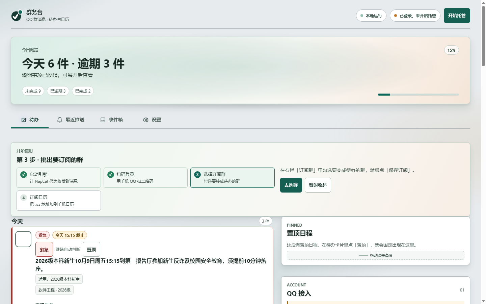

<div align="center">

# 群务台 · notice-hub

**把 QQ 群里的通知，自动变成待办和日历。**

从指定 QQ 群读取消息，过滤闲聊，提取通知、行动项和截止时间，集中到网页待办台，也可订阅手机日历。

[](LICENSE)
[](https://www.python.org/)

[](https://github.com/ExpertKT/notice-hub/actions/workflows/tests.yml)
[](https://github.com/ExpertKT/notice-hub/releases/latest)

[下载最新版](https://github.com/ExpertKT/notice-hub/releases/latest) · [使用说明](docs/使用说明.md) · [API 接入](docs/接API.md) · [安卓 App](docs/安卓App.md) · [NapCat 安装](docs/napcat-setup.md)

</div>

<p align="center">
  
</p>

## 适合谁

如果作业、实验、报名和考试时间散在多个 QQ 群里，群务台会把需要你行动的内容集中到一个页面。消息、摘要和待办默认保存在本机 SQLite；只有你配置的模型或推送通道会收到内容。

## 核心能力

- 按群白名单接收消息，闲聊降噪，候选事项先确认再进入待办。
- 待办按今天、本周、以后、已完成分组，支持完成、忽略、置顶和稍后提醒。
- 网页月历与 `/calendar.ics` 订阅，兼容 iPhone 和 Android 系统日历。
- 截止提醒、紧急事项直达，以及 WxPusher、Server酱、PushPlus、Webhook、QQ 私聊推送。
- PDF、Word、Excel、PPT、文本、压缩包和截图可解析，原文可回溯。
- 设置页可一键接入 NapCat、选群订阅，扫码成功后页面自动刷新。
- 手机 App 支持扫码配对；电脑端不再弹黑窗，出货包双击即用。
- 支持局域网、公网一键开通和 Tailscale，外网手机也能访问。

## 快速开始

### 1. 下载出货包（推荐）

1. 从 [Releases](https://github.com/ExpertKT/notice-hub/releases/latest) 下载 `QQ-Notice-Hub.zip` 并解压。
2. 双击 `QQ-Notice-Hub.exe`，浏览器会打开控制台。
3. 按页面四步引导操作：**启动引擎 → 扫码登录 → 选群 → 订阅日历**。
4. 设置页可开通公网地址或配置 Tailscale；NapCat 一键接入会显示登录二维码。

### 2. 安卓 App：扫码配对

1. 从 [Releases](https://github.com/ExpertKT/notice-hub/releases/latest) 下载 `notice-hub-android.apk` 并安装。
2. 在电脑端设置页的「手机 App」卡片显示二维码。二维码内容是 `noticehub://connect?base=…&token=…`，用手机 App 扫描后会自动连好，不用手填地址和 Token。
3. 扫不动二维码时，再使用卡片里的 **6 位数字手动配对码**。
4. 手机与电脑不在同一网络时，先在电脑端开通公网地址，或让两端加入同一个 Tailscale 网络。

App 只是手机端外壳，数据仍由电脑端服务处理；构建方式见 [docs/安卓App.md](docs/安卓App.md)。

### 3. 源码运行

```powershell
git clone https://github.com/ExpertKT/notice-hub.git
cd notice-hub
python -m venv .venv
.\.venv\Scripts\python.exe -m pip install -r requirements.txt
Copy-Item .env.example .env
.\.venv\Scripts\python.exe main.py doctor
.\.venv\Scripts\python.exe main.py run
```

`doctor` 先检查配置和依赖，`run` 启动服务（默认待办台端口为 8766）。

## 配置速查

从 `.env.example` 复制 `.env`。首页只列高频项，完整说明请看 `.env.example` 和 `docs/`。

| 变量 | 作用 |
| --- | --- |
| `QQ_DIGEST_GROUPS` | 要监控的群号，逗号分隔；留空则不处理群消息 |
| `QQ_DIGEST_ONEBOT_TOKEN` | 与 NapCat OneBot HTTP 配置一致 |
| `QQ_DIGEST_WEB` | 是否启用网页待办台 |
| `QQ_DIGEST_WEB_PORT` | 网页端口，默认 `8766` |
| `QQ_DIGEST_WEB_BASE_URL` | 公网入口，供手机和推送链接使用 |
| `WXPUSHER_APP_TOKEN` | WxPusher 应用 Token（可选） |
| `WXPUSHER_UIDS` | WxPusher 接收人（可选） |
| `QQ_DIGEST_LLM_API_KEY` | 可选模型 Key（旧名 `DASHSCOPE_API_KEY` 仍兼容）；不填则使用本地规则摘要 |

## 开发者

### 模块

| 文件 | 作用 |
| --- | --- |
| `qq_digest.py` | 消息过滤与摘要入口 |
| `qq_live_digest/receiver.py` | 接收 NapCat OneBot v11 上报 |
| `qq_live_digest/store.py` | SQLite 存储、去重和恢复 |
| `qq_live_digest/summarizer.py` | 提取待办、截止时间和推送文本 |
| `qq_live_digest/push.py` | 推送通道与失败回退 |
| `qq_live_digest/service.py` | 调度、补采、重试和服务生命周期 |
| `qq_live_digest/webapp.py` | 待办台、月历、收件箱和设置页 |
| `qq_live_digest/napcat_admin.py` | NapCat 探测、启停、配置和登录二维码 |
| `qq_live_digest/hosting.py` | QQ/NapCat 托管切换与状态持久化 |
| `packaging/launcher.py` | 出货包启动器、托盘和单实例互斥 |
| `main.py` | CLI 入口 |

### 命令与测试

`main.py` 当前注册的子命令：`run`、`tick`、`preview`、`stats`、`show`、`tasks`、`catchup`、`doctor`、`send-test`、`attach-test`。

```powershell
# 全量测试：392 项
.\.venv\Scripts\python.exe -m unittest discover -s tests -t .

# Windows 出货包
.\packaging\build.ps1
```

Android 工程使用 Gradle，构建环境为 **JDK 17 + Android SDK 35**。发布时打 tag，再执行 `gh release create` 上传出货包和 APK。

## 常见问题

<details>
<summary><b>连接检查失败 / 由于目标计算机积极拒绝（10061）</b></summary>

NapCat 或目标端口尚未运行。点「一键接入」或「启动并登录」，用手机 QQ 扫码，登录后刷新检测。

</details>

<details>
<summary><b>订阅读不到 / Failed to fetch</b></summary>

局域网地址只对同一网络有效。手机使用流量时，在设置页开通公网地址或配置 Tailscale，并重新复制带配对信息的订阅地址。

</details>

<details>
<summary><b>群里发了通知，网页没有</b></summary>

确认群在订阅白名单并已保存；再检查「待确认」分组。关机期间只补采最近 24 小时消息。

</details>

<details>
<summary><b>二维码过期 / 主号风控</b></summary>

登录二维码会自动刷新，点「刷新二维码」即可。NapCat 是第三方 QQ 协议客户端，登录主号有风控风险；本项目只读群消息，是否使用小号请自行判断。

</details>

## 隐私与安全

不要提交 `.env`、日志、SQLite、附件缓存或任何含 Token、UID、API Key 的文件。提交 Issue 和截图前，请打码 QQ 号、群号、域名、本机路径与消息内容。若密钥泄露，应立即作废并重新生成。

## 已知限制

- NapCat 和电脑端服务必须运行并保持登录，才能实时接收；关机期间依赖历史补采。
- 出货包仅支持 Windows；Android App 是电脑端服务的手机客户端。
- 摘要默认由本地规则生成；可选模型失败时会自动回退。

基于上游 [wc985732-lang/qq-live-digest](https://github.com/wc985732-lang/qq-live-digest) 二次开发，MIT。

## License

MIT License. See [LICENSE](LICENSE).
